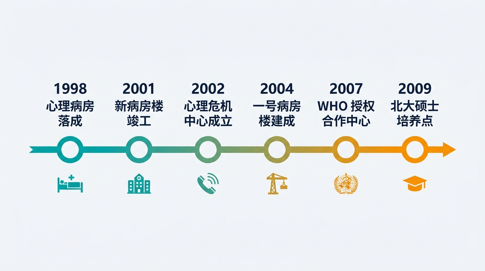
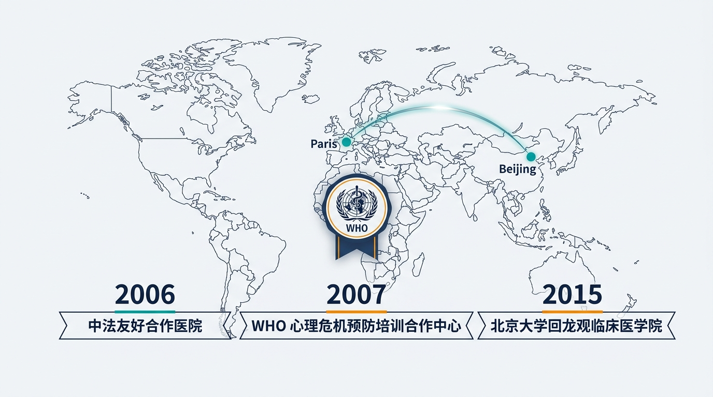
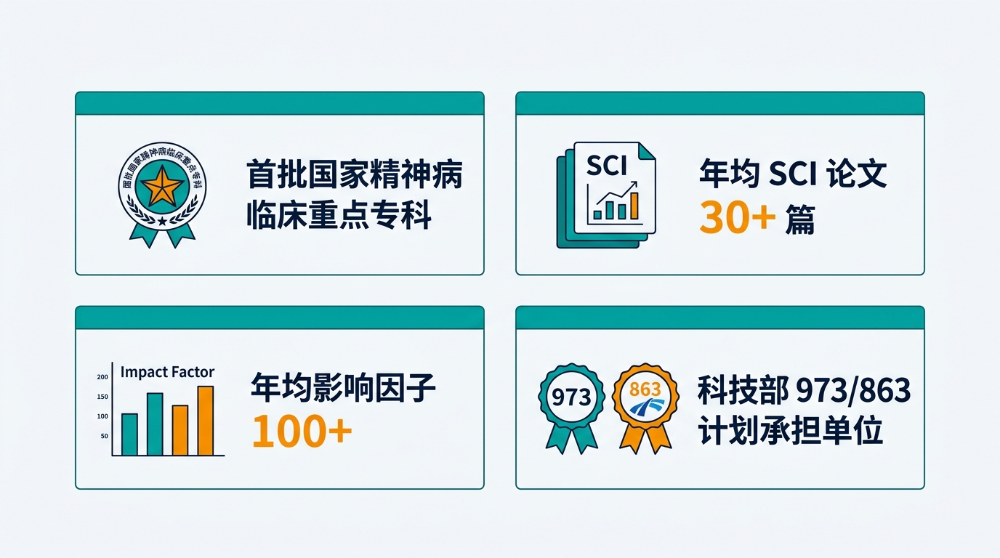

# Terry-slide-gen

> **You describe it. Claude builds it. You present it.**

Stop spending hours in PowerPoint. `slide-gen` is a Claude Code skill that turns your notes, outlines, or research into a polished `.pptx` — **fully autonomously**, in minutes.

[](https://github.com/TerryFYL/Terry-slide-gen/stargazers)
[](https://github.com/TerryFYL/Terry-slide-gen)
[](LICENSE)

---

## What does it look like?

<table>
  <tr>
    <td></td>
    <td></td>
  </tr>
  <tr>
    <td></td>
    <td></td>
  </tr>
  <tr>
    <td colspan="2"></td>
  </tr>
</table>

*All slides above were generated from a plain text outline in a single run — no manual editing.*

---

## Why this exists

Most AI slide tools make you:
- Answer 10 questions before anything happens
- Click "approve" at every single step
- Fix broken layouts yourself

`slide-gen` does it differently: **tell it what you need once, then get out of the way.**

---

## How it works

```
You describe → Claude collects everything upfront → runs end-to-end → delivers .pptx
```

1. **One intake** — content, style preference, real figures to embed (optional)
2. **Fully autonomous** — outline → prompts → AI images → PPTX assembly
3. **Interrupts only on hard blockers** — missing files, API failure

---

## Features

- 🎨 **16 visual style presets** — scientific, corporate, minimal, chalkboard, and more
- 🖼️ **Style extraction** — clone the look of any existing PPT or screenshot
- 📊 **Figure compositing** — embed real research charts (PNG/PDF) into slides via PIL
- 📐 **Auto 16:9 correction** on all generated images
- 🔁 **Partial workflows** — regenerate a single slide, outline-only, images-only
- 📦 **Outputs** — individual PNGs + assembled `.pptx`

---

## Installation

```bash
# Clone into your Claude Code global skills directory
git clone https://github.com/TerryFYL/Terry-slide-gen.git ~/.claude/skills/slide-gen

# Install Python dependencies
pip install google-genai python-pptx pillow pyyaml
```

Add your Gemini API key (free at [Google AI Studio](https://aistudio.google.com/)):

```bash
export GOOGLE_GENAI_KEY="your-key-here"
```

Or persist it in `~/.openclaw/credentials/.env`:
```
GOOGLE_GENAI_KEY="your-key-here"
```

---

## Usage

```
/slide-gen
```

You'll be asked **once** for:
| Item | Required | Default if skipped |
|------|----------|-------------------|
| Content | ✅ Yes | — |
| Style / reference PPT | No | Auto-inferred from content |
| Real figures to embed | No | All AI-generated |

Then Claude runs the full pipeline and delivers your `.pptx`.

### Command options

```bash
/slide-gen content.md                        # full pipeline
/slide-gen content.md --style scientific     # force a preset style
/slide-gen content.md --slides 12            # target slide count
/slide-gen content.md --outline-only         # outline only, skip images
/slide-gen slide-deck/topic/ --images-only   # regenerate from existing prompts
/slide-gen slide-deck/topic/ --regenerate 3  # redo slide #3 only
```

---

## Style presets

| Preset | Best for |
|--------|---------|
| `scientific` | Academic talks, medical, neuroscience |
| `intuition-machine` | Technical docs, bilingual |
| `blueprint` | Architecture, system design (default) |
| `corporate` | Business proposals, investor decks |
| `minimal` | Executive briefings |
| `chalkboard` | Teaching, classroom |
| `editorial-infographic` | Science communication |
| `bold-editorial` | Product launches, keynotes |
| `notion` | Product demos, SaaS |
| `dark-atmospheric` | Entertainment, gaming |
| `sketch-notes` | Educational tutorials |
| `watercolor` | Lifestyle, wellness |

---

## Output structure

```
slide-deck/{topic-slug}/
├── outline.yaml
├── prompts/
│   ├── 01-slide-cover.md
│   └── ...
├── 01-slide-cover.png
├── ...
└── {topic-slug}.pptx
```

---

## Requirements

- [Claude Code](https://claude.ai/code) (CLI)
- Python 3.10+
- `google-genai` `python-pptx` `pillow` `pyyaml`
- Gemini API key (free tier works for most decks)

---

## License

MIT — use it, fork it, ship it.

---

*If this saved you time, a ⭐ helps others find it: https://github.com/TerryFYL/Terry-slide-gen*
